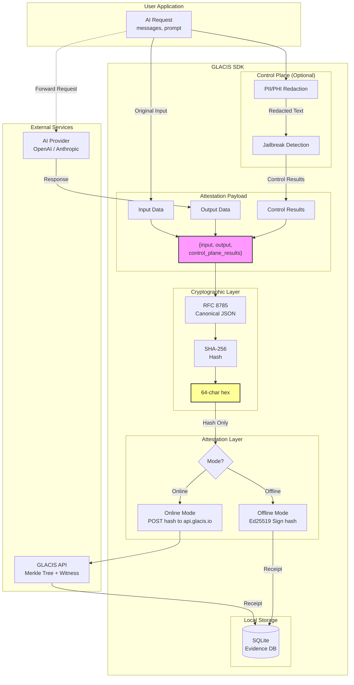
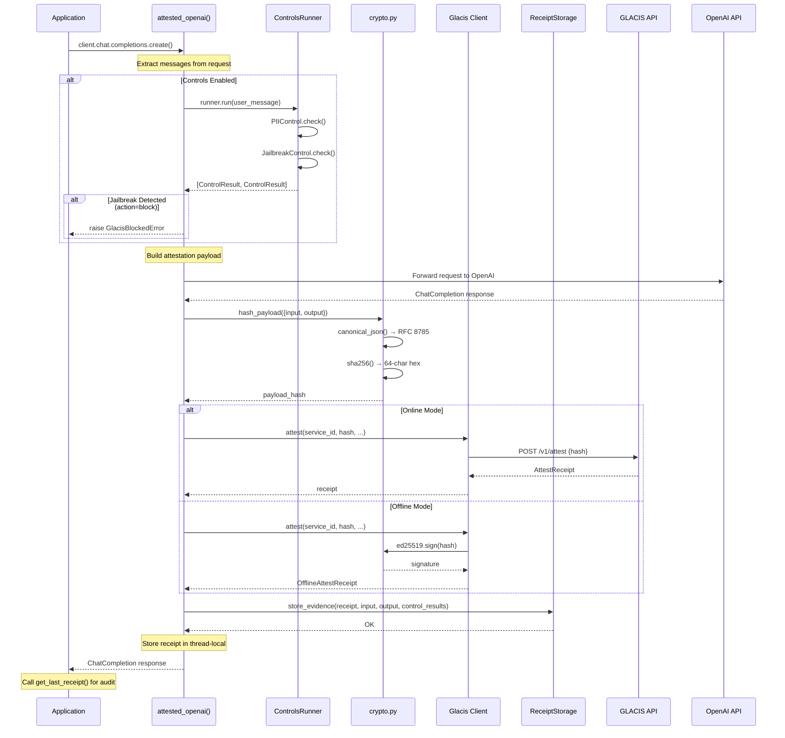
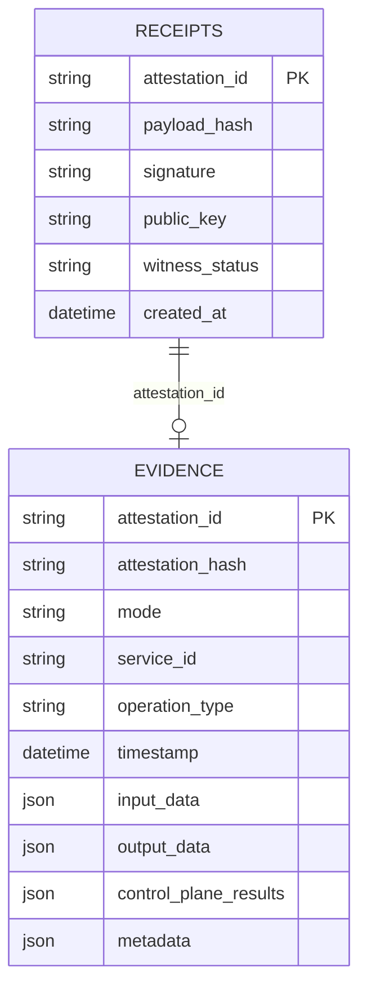
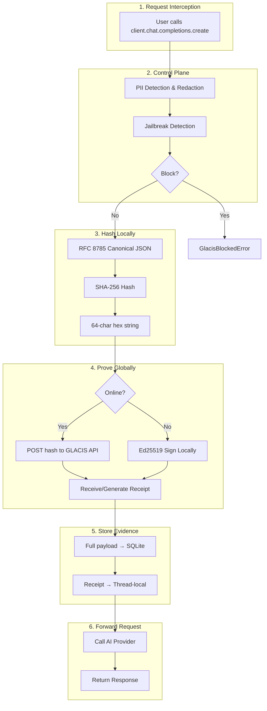

# GLACIS Attestation Pipeline

## High-Level Flow



## Detailed Integration Flow (OpenAI Example)



## Control Plane Pipeline

```mermaid
flowchart LR
    subgraph Input
        A[Raw Text]
    end

    subgraph PIIControl["PII Control"]
        B{Mode?}
        C[Fast Mode<br/>Regex Patterns]
        D[Full Mode<br/>Presidio NER]
        E[Redacted Text<br/>SSN: [US_SSN]]
    end

    subgraph JailbreakControl["Jailbreak Control"]
        F[PromptGuard<br/>Model]
        G{Score > Threshold?}
        H[action: pass]
        I[action: warn]
        J[action: block]
    end

    subgraph Output
        K[ControlResult[]]
    end

    A --> B
    B -->|fast| C
    B -->|full| D
    C --> E
    D --> E
    E --> F
    F --> G
    G -->|No| H
    G -->|Yes, warn| I
    G -->|Yes, block| J
    H --> K
    I --> K
    J --> K
```

## Online vs Offline Attestation

```mermaid
flowchart TB
    subgraph Online["Online Mode"]
        O1[Hash Payload]
        O2[POST to api.glacis.io]
        O3[Server Witnesses]
        O4[Add to Merkle Tree]
        O5[Return Signed Receipt]
        O6[verify_url for audit]

        O1 --> O2 --> O3 --> O4 --> O5 --> O6
    end

    subgraph Offline["Offline Mode"]
        F1[Hash Payload]
        F2[Ed25519 Sign Locally]
        F3[Generate oatt_ ID]
        F4[Store in SQLite]
        F5[witness_status: UNVERIFIED]

        F1 --> F2 --> F3 --> F4 --> F5
    end

    subgraph Verification["Later Verification"]
        V1[Load Receipt]
        V2{Online or Offline?}
        V3[Verify via API<br/>Merkle Proof]
        V4[Verify Signature<br/>Locally]
        V5[Valid + VERIFIED]
        V6[Valid + UNVERIFIED]

        V1 --> V2
        V2 -->|att_| V3 --> V5
        V2 -->|oatt_| V4 --> V6
    end
```



## Evidence Storage Schema



## Full Pipeline Summary


